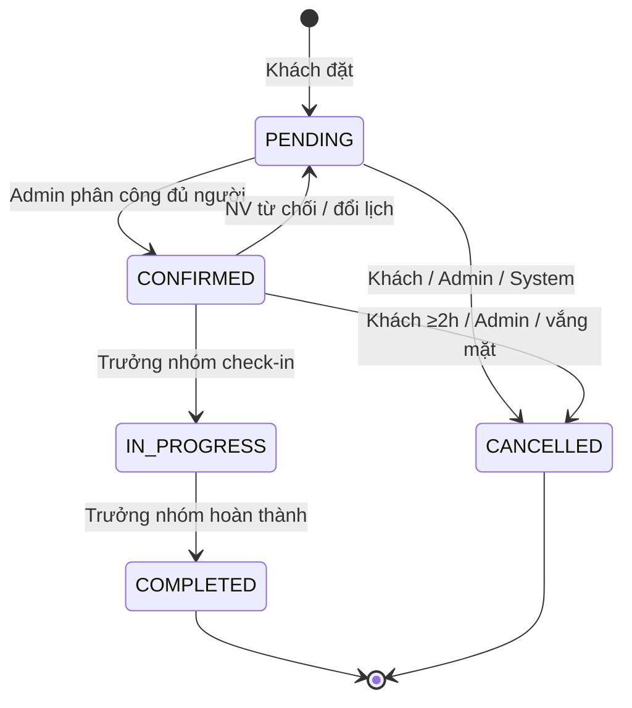
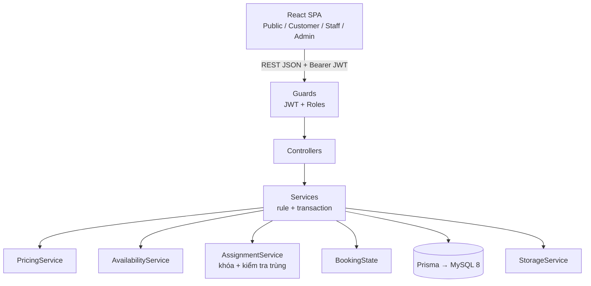

# Master Plan v2 — Nền tảng đặt lịch dịch vụ vệ sinh tại nhà (Đồ án 4)

Cập nhật: 2026-09-24 · Nguyễn Đức Hiệu

## 0. Quyết định đã chốt

Bản v2 thay thế hoàn toàn bản v1; mọi phần phía sau dựa trên 11 quyết định dưới đây.

| # | Quyết định |
| --- | --- |
| D1 | Mô hình công ty dịch vụ: nhân viên thuộc nền tảng, admin phân công, hệ thống gợi ý nhân viên rảnh |
| D2 | Giá theo khối lượng công việc, 2 đơn vị: UNIT (cái/bộ) và M2. Không có dịch vụ tính theo giờ |
| D3 | Giá lúc đặt là giá tạm tính; khối lượng thực tế được kiểm tra khi check-in, điều chỉnh khi khách xác nhận |
| D4 | Nhiều nhân viên cho một đơn: hệ thống tự tính số người từ tổng phút công, tối đa 4 (cấu hình được), có trưởng nhóm. Giá không đổi theo số người |
| D5 | Thanh toán trả sau (tiền mặt/chuyển khoản), trưởng nhóm hoặc admin xác nhận. Không cổng thanh toán, không hoàn tiền, không phí hủy |
| D6 | Trạng thái booking và trạng thái thanh toán tách riêng |
| D7 | Vùng phục vụ Hà Nội, mô hình tỉnh → khu vực → phường/xã (đơn vị hành chính 2 cấp sau 1/7/2025). Vùng là dữ liệu, đổi tỉnh không sửa code. Đồ án 4 chỉ 1 tỉnh hoạt động tại một thời điểm |
| D8 | Stack: NestJS + TypeScript + Prisma + MySQL 8; React + Vite + TypeScript + Tailwind + shadcn/ui |
| D9 | Làm một mình, 10 tuần code + 1–2 tuần dự phòng và báo cáo |
| D10 | Báo cáo có UML đầy đủ, vẽ dần theo từng phase |
| D11 | Deploy chưa quyết định; code viết sẵn sàng để deploy; hạn chót quyết định là cuối tuần 9 |

## 1. Tổng quan hệ thống

Website cho khách hàng tại Hà Nội đặt lịch dịch vụ vệ sinh tại nhà (tổng vệ sinh, sau xây dựng, kính, sofa, nệm, rèm) với giá theo khối lượng, niêm yết công khai. Công ty điều phối đội nhân viên của mình đến thực hiện. Hệ thống tự tính giá, thời lượng, số nhân viên, kiểm tra khung giờ còn đủ người, chống phân công trùng lịch và theo dõi vòng đời đơn đến lúc thu tiền và đánh giá.

Điểm nhấn kỹ thuật để bảo vệ:

1. Xếp lịch nhiều nhân viên có buffer di chuyển, theo khu vực.
2. Chống race condition khi phân công.
3. State machine booking, mọi thay đổi có lịch sử.
4. Snapshot giá và giá tạm tính có điều chỉnh.

## 2. Actor

| Actor | Vai trò |
| --- | --- |
| Guest | Xem dịch vụ, bảng giá, đánh giá; phải đăng nhập mới đặt lịch |
| Customer | Quản lý địa chỉ; đặt, theo dõi, hủy (đổi lịch nếu làm) booking; xác nhận điều chỉnh khối lượng; đánh giá |
| Staff | Xem lịch được giao, từ chối việc. Trưởng nhóm: check-in, đề xuất điều chỉnh, hoàn thành, xác nhận thu tiền, báo khách vắng mặt |
| Admin | Dịch vụ và bảng giá, vùng phục vụ, nhân viên, khách hàng, lịch nghỉ nhân viên; phân công và xử lý booking; thống kê |
| System | Job định kỳ (tự hủy đơn quá hạn không có người, nếu làm) |

## 3. Nghiệp vụ

### 3.1 Quy trình chính

1. Khách chọn dịch vụ, nhập khối lượng từng hạng mục (vd 80m² sàn, 1 sofa 3 chỗ).
2. Khách chọn địa chỉ (phường/xã) và ngày. Hệ thống tính giá tạm tính, tổng phút công, số nhân viên, thời lượng, rồi trả về các giờ bắt đầu còn đủ người rảnh trong khu vực.
3. Khách chọn giờ, xác nhận. Booking tạo ở PENDING; giá và địa chỉ được snapshot.
4. Admin xem gợi ý, chọn đủ N người + trưởng nhóm. Booking chuyển CONFIRMED.
5. Trưởng nhóm check-in (IN_PROGRESS), kiểm tra khối lượng thực tế; lệch thì đề xuất điều chỉnh, khách xác nhận trên app.
6. Xong việc: trưởng nhóm bấm hoàn thành (COMPLETED) và xác nhận đã thu tiền (PAID).
7. Khách đánh giá.

### 3.2 Tình huống đặc biệt

- **Khách hủy**: PENDING hủy tự do; CONFIRMED hủy được nếu còn ≥ 2 giờ, trong vòng 12 giờ thì tăng bộ đếm hủy muộn; từ IN_PROGRESS không hủy được.
- **Nhân viên từ chối** (khi CONFIRMED): gỡ riêng người đó, booking về PENDING, admin bổ sung người. Trưởng nhóm từ chối thì admin chỉ định trưởng nhóm mới.
- **Không có ai nhận**: admin hủy với lý do NO_STAFF_AVAILABLE (hoặc System tự hủy khi còn < 2 giờ, nếu làm job).
- **Khách vắng mặt**: sau giờ bắt đầu 30 phút, trưởng nhóm báo CUSTOMER_NO_SHOW; booking hủy, tính một lần hủy muộn.
- **Khối lượng thực tế lệch**: theo rule A01–A05.
- **Đổi lịch** (tùy chọn): chỉ đổi thời gian; nhóm cũ còn rảnh ở giờ mới thì giữ, không thì gỡ nhóm và về PENDING.

### 3.3 Cách tính giá

```
items_total = Σ (quantity × unit_price)
subtotal    = max(items_total, service.min_charge)
surcharge   = (T7/CN) ? subtotal × WEEKEND_RATE : 0      [tùy chọn]
total       = làm tròn 1.000đ (subtotal + surcharge)

man_minutes = Σ (quantity × minutes_per_unit)
staff_count = max(1, ceil(man_minutes / 240))
              > MAX_STAFF_PER_BOOKING → từ chối "Đơn quá lớn, vui lòng liên hệ"
duration    = làm tròn lên bội 30 phút (ceil(man_minutes / staff_count))
```

Ví dụ (số liệu minh họa): tổng vệ sinh 200m² (15.000đ/m², 2 phút/m²) + sofa 3 chỗ × 1 (350.000đ, 90 phút). Phút công 490 → 3 nhân viên → thời lượng 180 phút → tổng 3.350.000đ.

### 3.4 Danh mục dịch vụ demo

| Dịch vụ | Đơn vị | Ghi chú |
| --- | --- | --- |
| Tổng vệ sinh nhà đang ở | M2 | Có mức tối thiểu |
| Vệ sinh sau xây dựng | M2 | Đơn giá cao hơn |
| Vệ sinh kính | M2 | |
| Vệ sinh sofa, nệm, rèm | UNIT | Theo loại: sofa 3 chỗ, nệm 1m6, rèm 1 bộ… |
| Hạng mục phụ | UNIT | vd "Mang dụng cụ và hóa chất" × 1 |

## 4. Business rules

Nhãn: **[M]** bắt buộc · **[O]** làm nếu còn thời gian · **[TN]** Đồ án tốt nghiệp.

### Giá (P)

- P01 [M] Server luôn tự tính giá; giá do client gửi lên bị bỏ qua.
- P02 [M] Giá, tên hạng mục, địa chỉ snapshot vào booking; đổi bảng giá không ảnh hưởng đơn cũ.
- P03 [M] Tiền lưu Int VND, không dùng số thực.
- P04 [M] Áp dụng mức tối thiểu min_charge của dịch vụ.
- P05 [O] Phụ phí cuối tuần.
- P06 [TN] Phụ phí lễ Tết, voucher, giá theo tỉnh.

### Khối lượng và nhân viên (Q)

- Q01 [M] Hạng mục có min_qty, max_qty; hạng mục is_required bắt buộc có số lượng > 0.
- Q02 [M] Số nhân viên và thời lượng do hệ thống tính theo công thức 3.3; khách không chọn.
- Q03 [M] MAX_STAFF_PER_BOOKING trong cấu hình (mặc định 4); đặt bằng 1 là phương án an toàn.
- Q04 [M] Mỗi booking CONFIRMED có đúng 1 trưởng nhóm.

### Điều chỉnh khối lượng tại chỗ (A)

- A01 [M] Chỉ trưởng nhóm đề xuất, chỉ khi IN_PROGRESS.
- A02 [M] Chỉ sửa số lượng hạng mục thuộc dịch vụ đó (kể cả thêm hạng mục chưa đặt); không nhập giá tự do.
- A03 [M] Khách chấp nhận → áp dụng và tính lại giá; từ chối → giữ khối lượng đã đặt. Khách không dùng app được → admin gọi điện và xác nhận thay (ghi nhận người xác nhận).
- A04 [M] Tăng tối đa 30% tổng phút công; vượt thì chỉ làm khối lượng đã đặt, phần còn lại đặt đơn mới.
- A05 [M] Mỗi booking chỉ 1 đề xuất đang chờ tại một thời điểm.

### Thời gian (T) — giá trị nằm trong cấu hình

- T01 [M] Giờ bắt đầu theo bước 30 phút; phục vụ 07:00–20:00; giờ kết thúc ≤ 20:00.
- T02 [M] Đặt trước tối thiểu 3 giờ, tối đa 14 ngày.
- T03 [M] Buffer 30 phút giữa hai ca của cùng một nhân viên.
- T04 [M] Khung giờ khả dụng khi số nhân viên rảnh trong khu vực ≥ staff_count. Rảnh = đang hoạt động, thuộc khu vực, không nghỉ, không trùng booking đã giao (tính buffer).
- T05 [M] Kiểm tra mềm khi tạo: trừ staff_count của các booking PENDING chưa đủ người chồng giờ cùng khu vực. Bảo đảm cứng ở bước phân công.
- T06 [M] Phân công trong transaction: khóa dòng nhân viên theo id tăng dần (SELECT … FOR UPDATE), kiểm tra trùng lại, cập nhật booking kèm điều kiện version; xung đột → 409.
- T07 [M] Lưu UTC; rule giờ phục vụ và cuối tuần quy đổi sang giờ Việt Nam trước khi kiểm tra.
- T08 [O] Ngày không phục vụ (blocked_dates).

### Trạng thái (B)



Check-in chỉ trong khoảng 30 phút trước đến 60 phút sau giờ bắt đầu; hoàn thành khi không còn đề xuất điều chỉnh đang chờ.

- B01 [M] COMPLETED và CANCELLED là trạng thái cuối.
- B02 [M] Mỗi lần đổi trạng thái hoặc đổi nhóm đều ghi booking_status_histories.
- B03 [M] payment_status UNPAID → PAID, chỉ khi COMPLETED.
- B04 [M] Lý do hủy là enum: CUSTOMER_REQUEST, CUSTOMER_NO_SHOW, NO_STAFF_AVAILABLE, ADMIN_DECISION, OTHER, kèm ghi chú.

### Hủy, đổi lịch (C, R)

- C01–C03 [M] Như mục 3.2. C04 [TN] Phí hủy khi có thanh toán online.
- R01 [O] Đổi lịch khi PENDING/CONFIRMED, còn ≥ 2 giờ, tối đa 2 lần, chỉ đổi thời gian.

### Vùng phục vụ (Z)

- Z01 [M] Chỉ phường/xã đang hoạt động và thuộc một khu vực mới đặt được.
- Z02 [M] Đồ án 4: một thời điểm chỉ 1 tỉnh hoạt động.
- Z03 [M] Không hardcode tên tỉnh trong source (trừ file seed).

### Đánh giá (V)

- V01 [M] Chỉ khách của booking COMPLETED; mỗi booking 1 đánh giá; trong 7 ngày; không sửa.
- V02 [M] Điểm tính cho cả nhóm nhân viên của booking.
- V03 [O] Admin ẩn đánh giá.

### Tài khoản (U)

- U01 [M] Khách tự đăng ký; staff và admin do admin tạo, bắt đổi mật khẩu lần đầu.
- U02 [M] Không xóa cứng user, dịch vụ, hạng mục; chỉ khóa hoặc tắt.
- U03 [M] Không khóa nhân viên còn booking tương lai chưa được thay người.

## 5. Scope

- **MUST**: auth và phân quyền; catalog 2 đơn vị giá; vùng phục vụ; nhân viên, khu vực, lịch nghỉ (admin nhập); địa chỉ; báo giá + khả dụng nhiều nhân viên; tạo, hủy booking; phân công nhóm chống trùng; check-in, điều chỉnh khối lượng, hoàn thành, thu tiền; lịch sử trạng thái; đánh giá; dashboard rút gọn.
- **OPTIONAL** (theo thứ tự): đổi lịch → job tự hủy → ngày không phục vụ → phụ phí cuối tuần → admin ẩn đánh giá.
- **TN**: xem phần 18. **Không làm**: xem phần 19.

## 6. Chức năng theo actor

Quy ước: Input → Output | Rule | Chức năng phụ thuộc vào nó.

### Customer

- C01 Đăng ký: họ tên, email, SĐT, mật khẩu → tài khoản CUSTOMER | email/SĐT không trùng, mật khẩu ≥ 8 ký tự | mọi chức năng khách.
- C02 Đăng nhập, đăng xuất, refresh token | U01 | mọi chức năng cần đăng nhập.
- C03 Hồ sơ, đổi mật khẩu.
- C04 Địa chỉ: phường/xã, địa chỉ chi tiết, người liên hệ → danh sách địa chỉ | Z01, tối đa 5, xóa mềm | C06, C07.
- C05 Xem dịch vụ và chi tiết → hạng mục, đơn giá, đánh giá | chỉ mục đang hoạt động | C06.
- C06 Báo giá + khung giờ: hạng mục + số lượng, địa chỉ, ngày → giá, số người, thời lượng, danh sách giờ | P, Q, T01–T05 | C07.
- C07 Tạo booking → PENDING | kiểm tra lại toàn bộ ở server; tối đa 3 đơn PENDING mỗi khách | mọi chức năng phía sau.
- C08 Danh sách, chi tiết booking (lịch sử, nhóm nhân viên) | chỉ đơn của mình.
- C09 Hủy | C01–C03.
- C10 Xác nhận / từ chối điều chỉnh khối lượng | A03.
- C11 Đánh giá | V01.
- C12 [O] Đổi lịch | R01.

### Staff

- S01 Lịch được giao theo khoảng ngày (đánh dấu vai trò trưởng nhóm) | chỉ đơn của mình.
- S02 Từ chối việc, bắt buộc lý do | chỉ khi CONFIRMED.
- S03 Check-in (trưởng nhóm) | cửa sổ thời gian ở phần B.
- S04 Đề xuất điều chỉnh khối lượng (trưởng nhóm) | A01–A05 | C10.
- S05 Hoàn thành (trưởng nhóm) | không còn đề xuất đang chờ | C11, S06.
- S06 Xác nhận đã thu tiền (trưởng nhóm) | B03.
- S07 Báo khách vắng mặt (trưởng nhóm).

### Admin

- A01 CRUD dịch vụ và hạng mục giá | P02, U02 | C05, C06.
- A02 Vùng phục vụ: bật tỉnh, CRUD khu vực, gán và bật/tắt phường/xã | Z01–Z03 | C04, C06.
- A03 Quản lý nhân viên: tạo, sửa, khóa, gán khu vực | U01, U03 | A05.
- A04 Nhập lịch nghỉ nhân viên | không trùng booking đã giao | C06, A05.
- A05 Phân công nhóm: danh sách nhân viên + trưởng nhóm → CONFIRMED | đủ staff_count, T04, T06 | S01.
- A06 Danh sách, lọc (chưa phân công, quá giờ chưa check-in), chi tiết, hủy, xác nhận thu tiền thay, xác nhận điều chỉnh thay khách.
- A07 Quản lý khách hàng: xem, khóa.
- A08 Dashboard rút gọn: booking theo trạng thái, doanh thu tháng, điểm trung bình.

## 7. Database

16 bảng: 15 bắt buộc, 1 tùy chọn. PK là id trừ khi ghi khác; FK ghi rõ trong cột field.

| # | Bảng | Field chính | Ghi chú |
| --- | --- | --- | --- |
| 1 | users | email UQ, phone UQ, password_hash, full_name, role (CUSTOMER/STAFF/ADMIN), status (ACTIVE/LOCKED), must_change_password, late_cancel_count, timestamps | |
| 2 | refresh_tokens | user_id FK, token_hash, expires_at, revoked_at | |
| 3 | provinces | code UQ, name, is_active | |
| 4 | service_zones | province_id FK, name, is_active | Khu vực do công ty tự chia |
| 5 | wards | province_id FK, zone_id FK null, code UQ, name, type (PHUONG/XA), old_name_hint, is_active | |
| 6 | staff_zones | staff_id FK, zone_id FK | PK (staff_id, zone_id) |
| 7 | staff_unavailabilities | staff_id FK, start_at, end_at, reason, created_by FK | |
| 8 | addresses | user_id FK, ward_id FK, detail, label, contact_name, contact_phone, is_default, is_deleted | |
| 9 | services | name, slug UQ, description, image_url, min_charge, sort_order, is_active | |
| 10 | service_items | service_id FK, name, unit (UNIT/M2), unit_price, minutes_per_unit, min_qty, max_qty, is_required, sort_order, is_active | |
| 11 | bookings | code UQ, customer_id FK, service_id FK, ward_id FK, zone_id FK; snapshot: service_name, address_text, contact_name, contact_phone; start_at, end_at, man_minutes, staff_count, duration_minutes; items_total, subtotal, surcharge, total_price; status, payment_status, payment_method, paid_at, paid_confirmed_by FK; adjustment_status (NONE/PENDING/ACCEPTED/REJECTED); note; cancel_reason, cancel_note, cancelled_by FK, cancelled_at; reschedule_count; version; timestamps | Index (status, start_at), (zone_id, start_at) |
| 12 | booking_items | booking_id FK, service_item_id FK, name_snapshot, unit, unit_price, minutes_per_unit, quantity, proposed_quantity null, amount | proposed_quantity cho điều chỉnh |
| 13 | booking_assignments | booking_id FK, staff_id FK, is_leader, assigned_by FK, assigned_at | PK (booking_id, staff_id); index staff_id |
| 14 | booking_status_histories | booking_id FK, from_status, to_status, action, changed_by FK null, note, created_at | action: ASSIGN, DECLINE, ADJUST…; ghi cả khi trạng thái không đổi |
| 15 | reviews | booking_id FK UQ, customer_id FK, rating, comment, is_hidden, created_at | |
| 16 | blocked_dates [O] | date UQ, reason | |

**Không dùng**: service_categories, roles, payments, notifications, settings. Cấu hình để trong .env và file config.

**Tự kiểm tra**

- bookings.service_id và zone_id là denormalize có chủ đích để lọc và thống kê nhanh.
- Tìm trùng lịch: join booking_assignments với bookings theo staff_id, status ∈ {CONFIRMED, IN_PROGRESS}, điều kiện start_at < new_end + buffer AND end_at + buffer > new_start.
- Không dùng bảng time_slots; không FK booking → address mà thiếu snapshot; đánh giá gắn booking, không gắn dịch vụ.

## 8. ERD

Quan hệ và cardinality, dùng để vẽ ERD:

```
provinces 1──<N service_zones
provinces 1──<N wards
service_zones 1──<N wards                    (wards.zone_id, 0..1)
users(STAFF) N>──<N service_zones            qua staff_zones
users(STAFF) 1──<N staff_unavailabilities
users(CUSTOMER) 1──<N addresses
wards 1──<N addresses
services 1──<N service_items
users(CUSTOMER) 1──<N bookings
services 1──<N bookings
wards 1──<N bookings ;  service_zones 1──<N bookings
bookings 1──<N booking_items ;  service_items 1──<N booking_items
bookings N>──<N users(STAFF)                 qua booking_assignments (1..4, 1 trưởng nhóm)
bookings 1──<N booking_status_histories
bookings 1──0..1 reviews
users 1──<N refresh_tokens
```

## 9. Technology stack

| Tầng | Công nghệ |
| --- | --- |
| Backend | NestJS (TypeScript), Prisma + Prisma Migrate, MySQL 8 (Docker Compose) |
| Validation | class-validator + class-transformer, ValidationPipe toàn cục |
| Auth | @nestjs/jwt + @nestjs/passport + bcrypt |
| Tiện ích backend | @nestjs/config, @nestjs/swagger, @nestjs/throttler, @nestjs/schedule [O], helmet, multer, dayjs (utc + timezone) |
| Test | Jest + Supertest |
| Frontend | React + Vite + TypeScript, Tailwind + shadcn/ui, React Router |
| State, form, HTTP | TanStack Query (dữ liệu server), Zustand (chỉ auth), React Hook Form + Zod, Axios (interceptor refresh token), dayjs, sonner |

Không dùng: Redis, message queue, WebSocket, Maps, cổng thanh toán, email. Upload ảnh đi qua một StorageService: lưu local, đổi sang Cloudinary nếu deploy.

## 10. Architecture

Monolith phân lớp, chia module theo nghiệp vụ; business rule chỉ nằm ở service.



Filters và interceptors chuẩn hóa lỗi và response; Scheduler [O] chạy job định kỳ. Controller mỏng; frontend chỉ kiểm tra để trải nghiệm tốt hơn, backend mới quyết định; quyền sở hữu (chống IDOR) kiểm tra trong service.

## 11. Folder structure

```
root/
├─ backend/
│  ├─ src/
│  │  ├─ main.ts, app.module.ts
│  │  ├─ config/        # cấu hình + kiểm tra env
│  │  ├─ prisma/        # PrismaModule (global)
│  │  ├─ common/        # filters, interceptors, guards, decorators, dto, utils (money, time)
│  │  ├─ storage/
│  │  ├─ auth/  users/  catalog/  areas/  staff/
│  │  ├─ bookings/      # 3 controller theo role + bookings/pricing/availability/assignment service + booking-state.ts
│  │  └─ reviews/  dashboard/  scheduler/
│  ├─ prisma/          # schema.prisma, migrations/, seed.ts, data/areas/ha-noi.json
│  └─ test/
├─ frontend/src/
│  ├─ app/ (router, providers, guards)   api/   stores/   lib/   types/
│  ├─ components/ (ui/ shadcn, common/)  layouts/ (Public, Customer, Staff, Admin)
│  └─ features/ auth, catalog, booking, staff, admin, review
├─ docs/               # uml/*.puml, erd, đặc tả use case
└─ docker-compose.yml, README.md
```

Mỗi module backend có module, controller, service và thư mục dto; không thêm tầng repository vì PrismaService đã đảm nhận. Mỗi feature frontend tự chứa pages, components, api, hooks, schema.

## 12. API

Tiền tố /api/v1. Response thống nhất { success, data, message, errors }. Mã lỗi: 400 validate · 401 · 403 sai role hoặc không phải chủ sở hữu · 404 · 409 xung đột lịch/version · 422 vi phạm business rule.

### Auth và tài khoản

| Method | Endpoint | Role | Mục đích |
| --- | --- | --- | --- |
| POST | /auth/register | Public | Đăng ký khách |
| POST | /auth/login | Public | Trả access + refresh token |
| POST | /auth/refresh | Public | Cặp token mới |
| POST | /auth/logout | Đăng nhập | Thu hồi refresh token |
| GET | /auth/me | Đăng nhập | Người dùng hiện tại |
| PUT | /me · /me/password | Đăng nhập | Hồ sơ, đổi mật khẩu |
| GET/POST | /me/addresses | CUSTOMER | Danh sách, thêm địa chỉ |
| PUT/DELETE | /me/addresses/:id | CUSTOMER | Sửa, xóa mềm |

### Catalog và vùng phục vụ

| Method | Endpoint | Role | Mục đích |
| --- | --- | --- | --- |
| GET | /services · /services/:slug | Public | Danh sách, chi tiết + hạng mục |
| GET | /services/:id/reviews | Public | Đánh giá |
| GET | /service-areas | Public | Phường/xã đang phục vụ, nhóm theo khu vực |
| CRUD | /admin/services · /admin/services/:id/items | ADMIN | Dịch vụ, hạng mục giá |
| POST | /admin/uploads | ADMIN | Ảnh ≤ 2MB |
| PATCH | /admin/provinces/:id/activate | ADMIN | Bật tỉnh (tắt tỉnh cũ) |
| CRUD | /admin/zones | ADMIN | Khu vực |
| PATCH | /admin/wards/:id | ADMIN | Gán khu vực, bật/tắt |

### Booking (Customer)

| Method | Endpoint | Request chính → Response chính |
| --- | --- | --- |
| POST | /bookings/quote | serviceId, items[{serviceItemId, quantity}], addressId, date → giá chi tiết, manMinutes, staffCount, duration, availableStartTimes[] |
| POST | /bookings | serviceId, items, addressId, startAt, note → booking PENDING |
| GET | /me/bookings · /bookings/:id | lọc trạng thái → danh sách / chi tiết + lịch sử + nhóm |
| PATCH | /bookings/:id/cancel | reason, note → CANCELLED |
| PATCH | /bookings/:id/adjustment | accept/reject → giá mới hoặc giữ nguyên |
| POST | /bookings/:id/review | rating, comment → review |
| PATCH | /bookings/:id/reschedule [O] | newStartAt → booking cập nhật |

### Staff

| Method | Endpoint | Ai | Mục đích |
| --- | --- | --- | --- |
| GET | /staff/bookings?from&to | Staff | Lịch được giao |
| PATCH | /staff/bookings/:id/decline | Staff | Từ chối, kèm lý do |
| PATCH | …/check-in | Trưởng nhóm | IN_PROGRESS |
| POST | …/adjustment | Trưởng nhóm | items[{serviceItemId, proposedQuantity}] |
| PATCH | …/complete | Trưởng nhóm | COMPLETED |
| PATCH | …/confirm-payment | Trưởng nhóm | PAID + phương thức |
| PATCH | …/no-show | Trưởng nhóm | Hủy, khách vắng mặt |

### Admin

| Method | Endpoint | Mục đích |
| --- | --- | --- |
| GET | /admin/bookings · /admin/bookings/:id | Lọc, chi tiết |
| GET | /admin/bookings/:id/available-staff | Gợi ý nhân viên rảnh |
| PUT | /admin/bookings/:id/assignments | staffIds[], leaderId; thay cả nhóm một lần; số người = staffCount; 409 nếu trùng lịch hoặc version |
| PATCH | /admin/bookings/:id/cancel · /confirm-payment · /adjustment | Hủy, thu tiền thay, xác nhận điều chỉnh thay khách |
| CRUD | /admin/staff · /admin/staff/:id/zones · /admin/staff/:id/unavailabilities | Nhân viên, khu vực, lịch nghỉ |
| GET | /admin/customers | Danh sách khách |
| PATCH | /admin/users/:id/lock · /unlock | Khóa, mở khóa |
| GET | /admin/dashboard | Thống kê rút gọn |

## 13. User flow

1. **Đăng ký → đăng nhập** → quay về trang đang xem dở.
2. **Tìm dịch vụ**: trang chủ → danh sách → chi tiết (hạng mục, đơn giá, đánh giá).
3. **Đặt lịch** (wizard): nhập khối lượng → chọn địa chỉ (ngoài vùng thì báo ngay) → chọn ngày, giờ (kèm giá, số người, thời lượng) → xác nhận.
4. **Hệ thống**: tạo PENDING, snapshot, ghi lịch sử.
5. **Admin**: lọc đơn chưa phân công → xem gợi ý → chọn đủ N người + trưởng nhóm → CONFIRMED.
6. **Staff**: xem lịch → (từ chối) → trưởng nhóm check-in → (đề xuất điều chỉnh → khách xác nhận) → hoàn thành → thu tiền.
7. **Hoàn thành**: COMPLETED + PAID.
8. **Đánh giá**: trong 7 ngày.
9. **Hủy**: theo rule C.
10. **Đổi lịch** [O]: theo rule R.

## 14. Edge cases

- **Đặt lịch**: giờ vừa hết chỗ khi xác nhận (409, chọn lại); admin đổi giá giữa báo giá và đặt (báo giá lại); bấm đặt 2 lần; thời lượng vượt 20:00; đơn vượt MAX_STAFF; phường vừa bị tắt.
- **Phân công**: 2 admin cùng phân công một đơn; một nhân viên bị phân vào 2 đơn trùng giờ cùng lúc; deadlock khi khóa nhiều nhân viên (khóa theo id tăng dần); nhân viên bị khóa hoặc đang nghỉ; số người khác staff_count; thiếu trưởng nhóm.
- **Thực hiện**: check-in ngoài cửa sổ thời gian; thành viên thường gọi API của trưởng nhóm; điều chỉnh vượt 30%; hoàn thành khi còn đề xuất đang chờ; khách hủy đúng lúc check-in; quên bấm hoàn thành.
- **Dữ liệu**: lệch múi giờ; tắt khu vực khi còn đơn tương lai; khóa nhân viên còn đơn tương lai; đánh giá gửi 2 lần.

## 15. Security

- Mật khẩu hash bằng BCrypt; JWT secret trong .env, không commit.
- Access token 30 phút; refresh token 7 ngày, lưu hash, thu hồi được.
- RolesGuard + kiểm tra quyền sở hữu trong service để chống IDOR: khách đổi id xem đơn người khác, staff xem đơn không được giao, thành viên thường gọi API của trưởng nhóm.
- ValidationPipe với whitelist và forbidNonWhitelisted; không trả password_hash (dùng select).
- helmet; CORS chỉ mở cho domain frontend; throttle login và register.
- Upload: kiểm tra MIME, giới hạn 2MB, đổi tên file.
- Staff chỉ thấy địa chỉ và SĐT khách của đơn mình được giao; không log token.

## 16. Roadmap 10 tuần

9 phase trong 10 tuần code, tuần 11–12 dự phòng và báo cáo; mốc kiểm tra rủi ro ở cuối tuần 7.

| Tuần | Phase | Sơ đồ UML đi kèm |
| --- | --- | --- |
| 1 (nửa đầu) | 0 — Setup | Use case tổng quát |
| 1–2 | 1 — Auth | Đặc tả use case, sequence đăng nhập + refresh |
| 2–3 | 2 — Catalog + vùng phục vụ | Activity đặt lịch, state machine booking |
| 4 | 3 — Nhân viên + địa chỉ | ERD / class diagram bản 1 |
| 5–6 | 4 — Booking lõi | Sequence đặt lịch |
| 7 | 5 — Phân công nhóm ⚠ | Sequence phân công (cơ chế khóa) |
| 8 | 6 — Staff thực hiện | Sequence check-in + điều chỉnh |
| 9 | 7 — Đánh giá, dashboard, tùy chọn | |
| 10 | 8 — Hoàn thiện | Component, deployment, ERD bản cuối |
| 11–12 | Dự phòng + báo cáo | Ghép báo cáo |

### Phase 0 — Setup

- **Mục tiêu**: dự án chạy được trên mọi máy, có khung dùng chung.
- **DB**: chỉ datasource, chưa có bảng nghiệp vụ. **API**: /health. **FE**: router, 4 layout, provider, axios instance.
- **Phụ thuộc**: không.
- **Hoàn thành khi**: Docker MySQL chạy; backend và Swagger chạy; /health báo db up; test e2e pass; FE hiển thị kết quả /health.

### Phase 1 — Auth

- **DB**: users, refresh_tokens + seed admin. **API**: /auth/*, /me. **FE**: đăng ký, đăng nhập, route guard, interceptor refresh.
- **Phụ thuộc**: Phase 0.
- **Hoàn thành khi**: 3 role vào đúng khu vực; token hết hạn tự refresh; bắt đổi mật khẩu lần đầu hoạt động.
- **Test**: e2e các case 401/403.

### Phase 2 — Catalog + vùng phục vụ

- **DB**: services, service_items, provinces, service_zones, wards + seed Hà Nội. **API**: catalog, /service-areas, CRUD admin. **FE**: trang dịch vụ; admin quản lý dịch vụ và vùng.
- **Phụ thuộc**: Phase 1.
- **Hoàn thành khi**: tạo được dịch vụ và hạng mục; bật/tắt phường có tác dụng; không có "Hà Nội" ngoài file seed.
- **Test**: validate giá, min/max_qty.

### Phase 3 — Nhân viên + địa chỉ

- **DB**: staff_zones, staff_unavailabilities, addresses. **API**: /admin/staff*, /me/addresses. **FE**: admin quản lý nhân viên, lịch nghỉ; khách quản lý địa chỉ.
- **Phụ thuộc**: Phase 2.
- **Hoàn thành khi**: nhân viên gán được nhiều khu vực; địa chỉ ngoài vùng bị chặn.

### Phase 4 — Booking lõi

- **DB**: bookings, booking_items, booking_status_histories. **API**: quote, tạo, danh sách, chi tiết, hủy. **FE**: wizard đặt lịch, lịch sử và chi tiết.
- **Phụ thuộc**: Phase 2, 3.
- **Hoàn thành khi**: giá, số người, thời lượng đúng công thức; giờ không đủ người không hiện; snapshot đúng; hủy đúng rule.
- **Test**: unit test PricingService, AvailabilityService (biên 20:00, buffer, báo trước 3 giờ, min_charge, vượt MAX_STAFF); e2e IDOR.

### Phase 5 — Phân công nhóm ⚠

- **DB**: booking_assignments. **API**: available-staff, PUT assignments. **FE**: dialog chọn nhóm + trưởng nhóm.
- **Phụ thuộc**: Phase 4.
- **Hoàn thành khi**: không thể phân công trùng lịch kể cả khi hai request đồng thời.
- **Test**: integration test hai luồng song song chỉ một thành công; thử phân công chéo nhiều nhân viên để kiểm tra deadlock.
- **Mốc rủi ro**: cuối tuần 7 chưa ổn → đặt MAX_STAFF_PER_BOOKING = 1, schema giữ nguyên.

### Phase 6 — Staff thực hiện

- **API**: /staff/bookings/*, xác nhận điều chỉnh của khách. **FE**: lịch làm việc staff (ưu tiên mobile), màn hình điều chỉnh khối lượng.
- **Phụ thuộc**: Phase 5.
- **Hoàn thành khi**: chạy trọn PENDING → CONFIRMED → IN_PROGRESS → (điều chỉnh) → COMPLETED → PAID; từ chối thì đơn về PENDING.
- **Test**: unit test bảng chuyển trạng thái; rule A01–A05.

### Phase 7 — Đánh giá, dashboard, tùy chọn

- **DB**: reviews (+ blocked_dates). **API**: review, dashboard, các mục [O].
- **Hoàn thành khi**: đánh giá đúng rule V; đã chốt quyết định deploy.

### Phase 8 — Hoàn thiện

- Rà soát bảo mật theo phần 15; seed dữ liệu demo đủ kịch bản; README; kịch bản demo; deploy nếu đã chọn.

**Nếu chỉ còn 8 tuần**: bỏ Phase 7 (gộp đánh giá vào Phase 6), bỏ mọi mục [O], cân nhắc đặt MAX_STAFF = 1 từ đầu.

## 17. Testing strategy

- **Unit (Jest)**: PricingService, AvailabilityService, BookingState, rule điều chỉnh khối lượng, rule hủy. Đây là nơi test mang lại nhiều giá trị nhất.
- **Integration / e2e (Supertest + MySQL Docker)**: phân công đồng thời, luồng booking đầu-cuối, phân quyền 401/403/IDOR.
- **Thủ công**: Swagger/Postman theo module; checklist frontend từng role; chạy lại kịch bản demo sau mỗi phase.
- **Dữ liệu demo**: nhân viên rảnh và bận, đơn đủ và chưa đủ người, đơn hoàn thành có đánh giá, phường ngoài vùng.

## 18. Để dành cho Đồ án tốt nghiệp

1. Đặt lịch định kỳ.
2. Tự động phân công hoặc staff tự nhận đơn.
3. Thanh toán online (VNPay/MoMo), phí hủy, hoàn tiền (thêm bảng payments).
4. Nhiều tỉnh chạy song song, giá theo tỉnh.
5. Ca làm việc theo tuần cho từng nhân viên.
6. Thông báo realtime (WebSocket), email, push notification.
7. Ảnh trước/sau khi làm, khiếu nại.
8. Dịch vụ tính theo giờ (HOUR), voucher, phụ phí lễ.
9. App mobile cho staff (React Native).

## 19. Không nên làm

Microservices; Redis hoặc queue khi chưa có vấn đề tải; chat; AI; ví điện tử và hoa hồng; tính giá theo bản đồ/khoảng cách; SSR chỉ để "cho mới"; tích hợp nhiều cổng thanh toán; thêm thư viện ngoài phần 9 khi chưa được duyệt.

## 20. Nguyên tắc code và checklist

### Nguyên tắc

14 nguyên tắc đã thống nhất (xem CLAUDE.md), cộng thêm:

- Mỗi task có spec (mục tiêu, phạm vi BE/FE, file dự kiến, rule liên quan, cách test), được duyệt trước khi code.
- Migration đã chạy thì không sửa; muốn đổi thì tạo migration mới.
- Không trả object Prisma trực tiếp ra ngoài.
- Một nhánh git mỗi phase; commit theo convention (feat(booking): …).
- Definition of Done: build pass, test liên quan pass, đã test tay, đã cập nhật Swagger/tài liệu, đã báo file thay đổi và không thay đổi.

### Checklist tiến độ

- [x] Duyệt master plan v2
- [ ] Phase 0 — Setup · use case tổng quát
- [ ] Phase 1 — Auth · sequence đăng nhập
- [ ] Phase 2 — Catalog + vùng Hà Nội · activity + state machine
- [ ] Phase 3 — Nhân viên + địa chỉ · ERD bản 1
- [ ] Phase 4 — Booking lõi + unit test · sequence đặt lịch
- [ ] Phase 5 — Phân công nhóm + test đồng thời · mốc tuần 7
- [ ] Phase 6 — Staff thực hiện + test state machine
- [ ] Phase 7 — Đánh giá, dashboard · chốt deploy
- [ ] Phase 8 — Bảo mật, seed demo, README, kịch bản demo · component/deployment
- [ ] Báo cáo hoàn chỉnh
